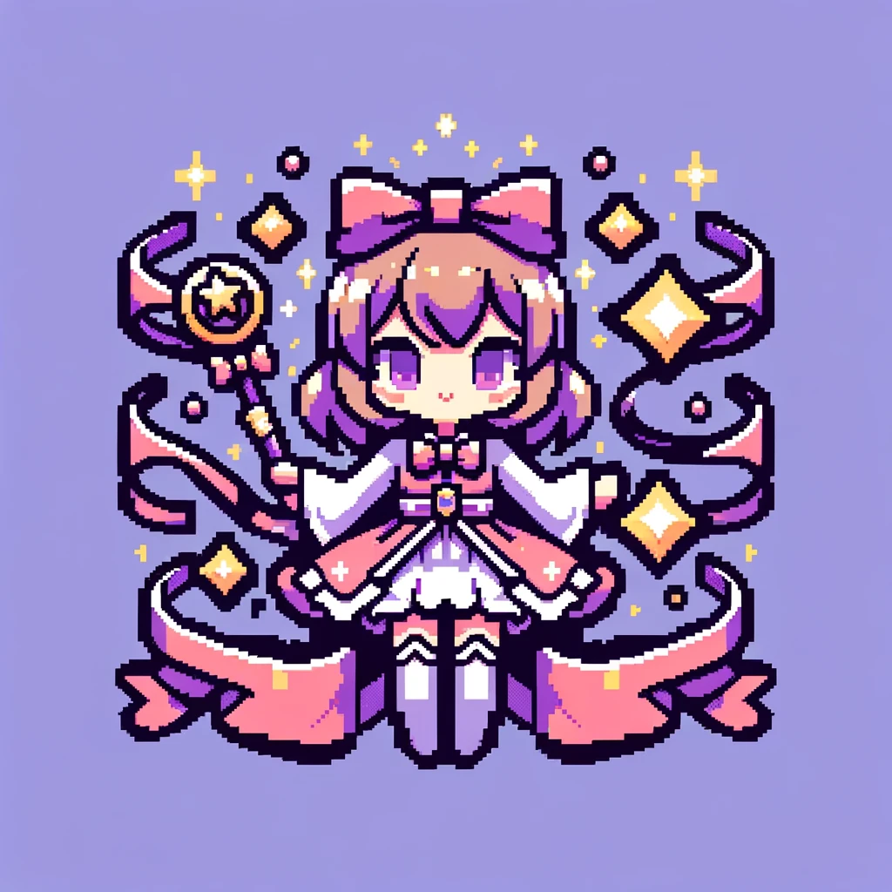

# Stella-OpenAI

</img>

このコードは、Discordで動作するチャットボット「ステラちゃん」を実装したC#プログラムです。上記の`bot Invite`からサーバーにBotを招待することができます。

## 使用しているライブラリ
- Discord.Net
- Newtonsoft.Json
- OpenAI_API

## 環境変数
- `TOKEN_DISCORD`: Discord Botのトークンを設定します。
- `TOKEN_OPENAI`: OpenAI APIのトークンを設定します。

## SlashCommand
- /version : Stella-Chanのバージョンを表示します。
- /enable : Stella-Chanとの会話をコマンドを実行したチャネルで有効化します。
- /disable : Stella-Chanとの会話をコマンドを実行したチャンネルで無効化します。
- /reset : 実行したチャンネルのStella-ChanのConversationを初期化します。
- /create-image : Stella-Chanがお絵描きをしてくれます。実行するとModalが表示されるので書いて欲しい絵を入力してください。
